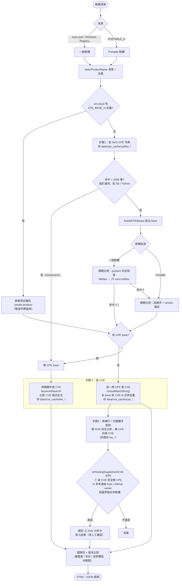

# CVE 查找流程圖

本圖說明從「一份軟體清單」到「產生報表」的完整處理流程，含 CPE 比對、CVE 查詢與快取機制。
（GitHub 與 VS Code 的 Markdown 預覽可直接渲染下方 Mermaid 圖。）

## 三種快取

| 快取檔 | 目錄 | 內容 | 產生時機 |
|--------|------|------|----------|
| `cpekw_<軟體名>` | `data/cpe_cache/` | CPE 字典查找結果（vendor:product 條目清單） | 步驟 1 |
| `cpe_<vendor>_<product>` | `data/cve_cache/` | 用 **CPE** 找到的 CVE | 步驟 2（CPE 模式） |
| `kw_<關鍵字>` | `data/cve_cache/` | 用 **關鍵字** 找到的 CVE | 步驟 2（無 CPE 時）與步驟 3 補撈 |

## 快取保留與更新

快取檔**永不自動刪除**（無 TTL），是否重查依「是否跨日曆天」決定：

- **同一天內**重複掃描 → 直接用快取，**完全不打 NVD API**（NVD 以「天」為單位才有新資料）。
- **跨天**後再掃：
  - CVE 快取（`cpe_*` / `kw_*`）→ **增量查詢**：用 `lastModStartDate` 只撈「上次抓取後被修改過」的 CVE，合併去重。
  - CPE 字典快取（`cpekw_*`）→ **整批重抓**（CPE 字典無增量機制）。
- 要更舊年份（`MIN_YEAR` 調大）→ 只補查缺少的舊範圍。首次查詢 → 全量（120 天/段，由新到舊）。
- `CACHE_DISABLE=true` 可停用所有本機快取。
